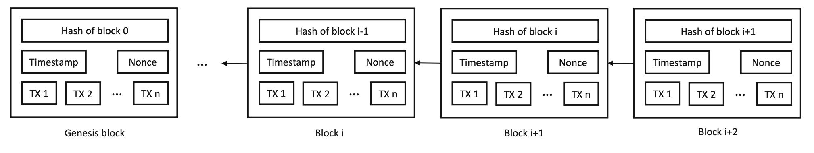
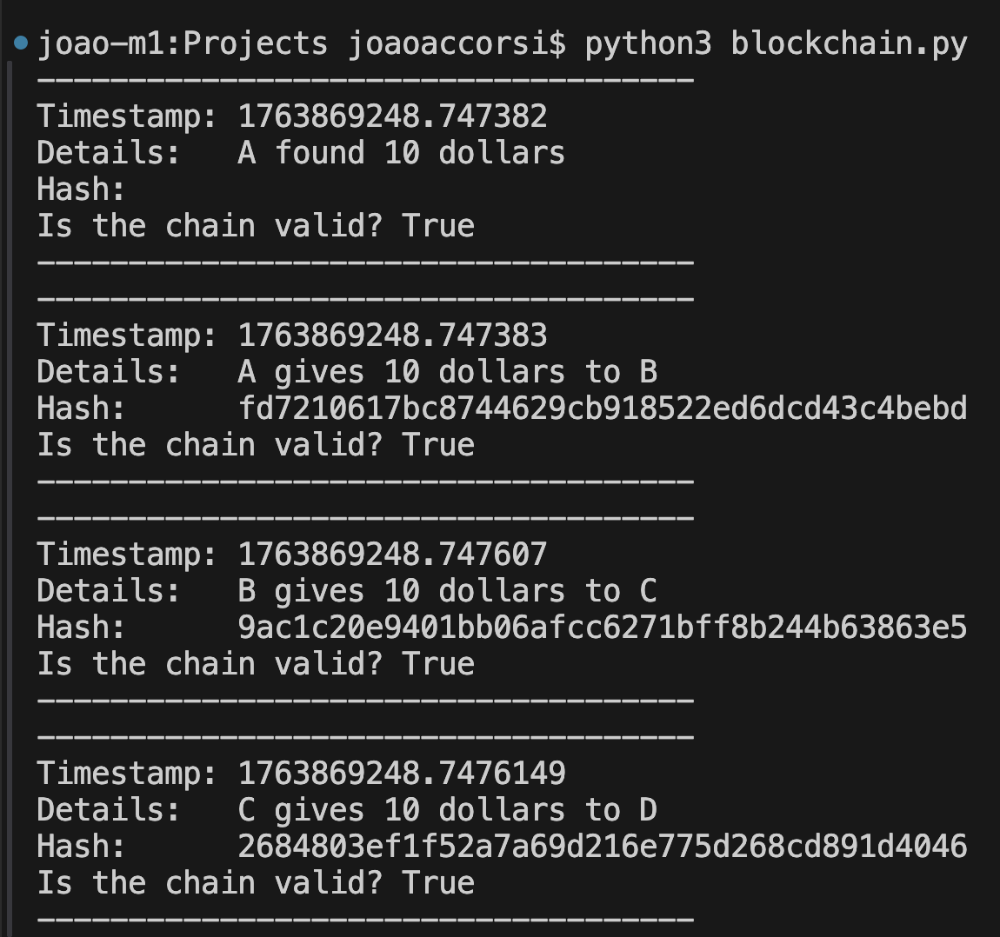

## ⛓️ Blockchain

Blockchain is a distributed technology which works with a history of public transactions, consisting of a chain of data packets called blocks. The central concept is the use of encrypted data where each block contains transactions, a timestamp, a hash key built with the data within the block and connected to the next block. Real blockchain networks also have a nonce (a random number that validates the block).



Based in article [What Is the Blockchain?](https://cse.sc.edu/~mgv/csce190f18/diPierro_mcs2017050092.pdf), from Massimo Di Pierro, this sample project has been implemented to simulate a blockhain network for study purposes.

## 🧑‍💻 How does it work?

This code is a simple demonstration of a blockchain:
- Each block contains a timestamp, details and hash.
- Every block’s hash depends on the previous block.
- If any block is modified, the chain becomes invalid.

</br>

- `bhash` function: Given a timestamp, block details, and previous hash (if any), a new hash is generated.

- `Blockchain` class: Responsible to represent the blockchain.
    - `record` method: Creates a new block, and inserts it into the chain by generating a new hash, using the hash of lastest block.
    - `verify` method: Verify chain's integrity by recalculating each block’s hash using the previous block, and in case any hash does not match the stored one, the blockchain is invalid.


## 🚀 How to run it?

```
python3 blockchain.py
```

## 📈 Output

